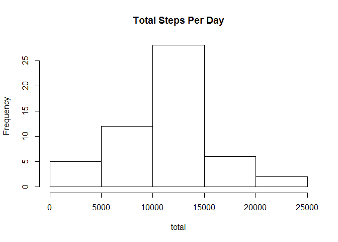
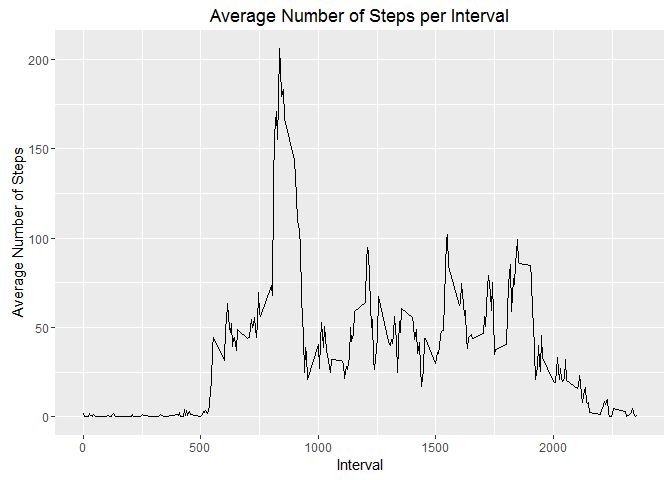
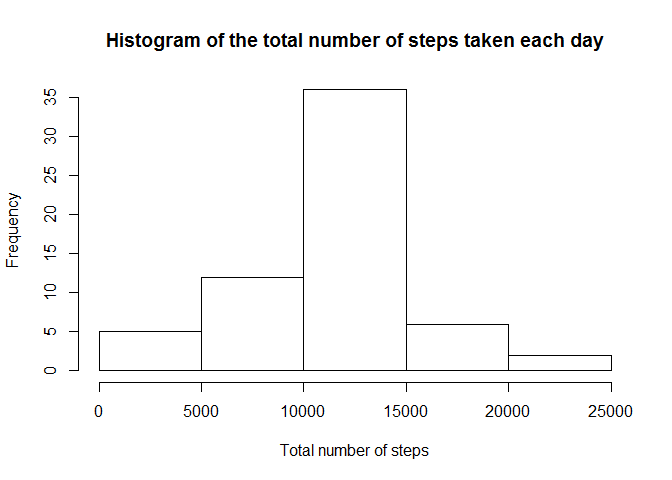

# Reproducible Research: Peer Assessment 1
Reproducible Research: Peer Assessment 1
========================================

## Loading and preprocessing the data


```r
setwd("c:/Users/Mahmoud/Desktop/rep")
mydata<-read.csv("activity.csv")
library(lubridate)
```

```
## Warning: package 'lubridate' was built under R version 3.2.3
```

```r
mydata$date <- ymd(mydata$date)
```

## What is mean total number of steps taken per day?

1.Make a histogram of the total number of steps taken each day


```r
total<-tapply(mydata$steps, mydata$date, sum)
hist(total, main="Total Steps Per Day")
```



2.Calculate and report the mean and median total number of steps taken per day


```r
mean(total, na.rm = TRUE)
```

```
## [1] 10766.19
```

```r
median(total, na.rm = TRUE)
```

```
## [1] 10765
```
## What is the average daily activity pattern?

1.Make a time series plot (i.e. type = "l") of the 5-minute interval (x-axis) and the average number of steps taken, averaged across all days (y-axis)


```r
library(plyr)
```

```
## Warning: package 'plyr' was built under R version 3.2.3
```

```
## 
## Attaching package: 'plyr'
```

```
## The following object is masked from 'package:lubridate':
## 
##     here
```

```r
library(ggplot2)
```

```
## Warning: package 'ggplot2' was built under R version 3.2.3
```

```r
mydata2<-mydata[!is.na(mydata$steps), ]
new<-ddply(mydata2, .(interval), summarize, Average=mean(steps))
p <- ggplot(new, aes(x=interval, y=Average))
p + geom_line()+xlab("Interval")+ylab("Average Number of Steps")+ggtitle("Average Number of Steps per Interval")
```



2.Which 5-minute interval, on average across all the days in the dataset, contains the maximum number of steps?


```r
new[which.max(new$Average), ]
```

```
##     interval  Average
## 104      835 206.1698
```
The maximum number of steps for a 5-minute interval was 206 steps.

The 5-minute interval which had the maximum number of steps was the 835 interval.

## Imputing missing values

1.Calculate and report the total number of missing values in the dataset (i.e. the total number of rows with NAs)


```r
sum(is.na(mydata))
```

```
## [1] 2304
```

2.Devise a strategy for filling in all of the missing values in the dataset. The strategy does not need to be sophisticated. For example, you could use the mean/median for that day, or the mean for that 5-minute interval, etc.

I used the means for the 5-minute intervals as fillers for missing values.


```r
steps.interval <- aggregate(steps ~ interval, data = mydata, FUN = mean)
mydata<- merge(mydata, steps.interval, by = "interval", suffixes = c("", ".y"))

nas <- is.na(mydata$steps)

mydata$steps[nas] <- mydata$steps.y[nas]
mydata <- mydata[, c(1:3)]
```

3.Make a histogram of the total number of steps taken each day and Calculate and report the mean and median total number of steps taken per day. Do these values differ from the estimates from the first part of the assignment? What is the impact of imputing missing data on the estimates of the total daily number of steps?


```r
steps.date <- aggregate(steps ~ date, data = mydata, FUN = sum)
hist(steps.date$steps, xlab = "Total number of steps", main =  "Histogram of the total number of steps taken each day")
```



```r
mean(steps.date$steps)
```

```
## [1] 10766.19
```

```r
median(steps.date$steps)
```

```
## [1] 10766.19
```

The impact of the missing data seems low

## Are there differences in activity patterns between weekdays and weekends?

1.Create a new factor variable in the dataset with two levels -- "weekday" and "weekend" indicating whether a given date is a weekday or weekend day.


```r
Days <- function(date) { day <- weekdays(date) 
if (day %in% c("Monday", "Tuesday", "Wednesday", "Thursday", "Friday")) 
 return("weekday") else (day %in% c("Saturday", "Sunday")) 
  return("weekend") }
 
mydata$date <- as.Date(mydata$date)
mydata$day <- sapply(mydata$date, FUN = Days)
```

2.Make a panel plot containing a time series plot (i.e. type = "l") of the 5-minute interval (x-axis) and the average number of steps taken, averaged across all weekday days or weekend days (y-axis).


```r
averages <- aggregate(steps ~ interval + day, data = mydata, mean)
ggplot(averages, aes(interval, steps)) + geom_line() + facet_grid(day ~ .) +  xlab("5-minute interval") + ylab("Number of steps")
```


   


